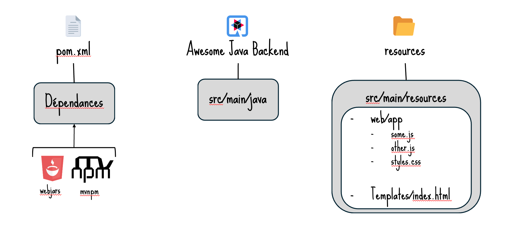
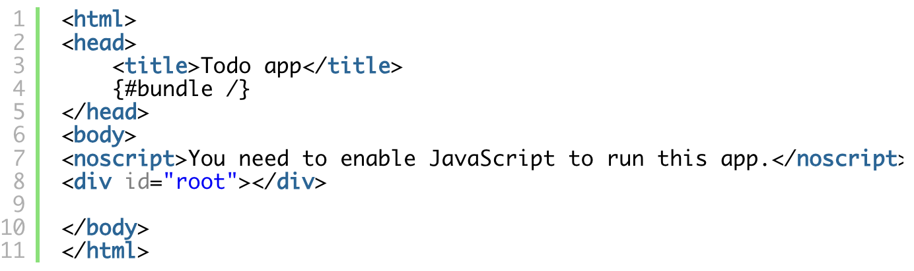

# Bridging the Gap: Full-Stack Development Without the Headaches

Working on web projects often means dealing with two separate environments-one for the backend and another for the frontend-each with its own ecosystem. Developers frequently run into issues when dealing with the ecosystem of their counterpart, creating a needless wall between front-end and back-end developers. You have to use unfamiliar tools, follow API changes, create mocks, and have a hard time creating e2e tests. Overall, this makes development unnecessarily frustrating and a time-consuming process.

That's where [Quarkus](https://quarkus.io/) enters. Although Quarkus is mostly known as the Kubernetes-native Java framework for optimizing Java applications for cloud-native settings, it offers way more than that. Enhancing the Developer Experience is one of Quarkus's main priorities. For instance, it will automatically start a container for your database and Kafka if it uses either of these. Additionally, it has hot reload, which lets you code without ever having to restart your application. These are just a few examples of what Quarkus provides.

Quarkus has a wide range of extensions, including frontend-focused ones. It provides what the Quarkus team calls "the rainbow" of front-end technologies. The "rainbow" includes both client-side and server-side rendering. We'll concentrate on the second here.

## Quinoa: Develop, build, and serve your npm-compatible web applications

### Why Choose Quinoa?

Let's start by discussing [Quinoa](https://docs.quarkiverse.io/quarkus-quinoa/dev/index.html) . Quinoa is perhaps the most straightforward choice if you already have a front-end that works flawlessly with any JavaScript framework (React, Angular, Vue.js, ...). It's extremely simple to use.

### Setting Up Quinoa

First you need a Quarkus project. If you don't already have one you can create one with the right extension either by going to [this url](https://code.quarkus.io/?e=rest&e=rest-jackson&e=io.quarkiverse.quinoa%3Aquarkus-quinoa) or you can install the [Quarkus CLI](https://quarkus.io/guides/cli-tooling) and then execute:

```sh
quarkus create app code-full-stack -x=quarkus-quinoa -x=quarkus-rest-jackson -x=quarkus-rest
```

But if you already have one you can simply add the Quinoa extension to your Quarkus project by either using the Quarkus CLI

```sh
quarkus ext add io.quarkiverse.quinoa:quarkus-quinoa
```

or if you're using maven:

```sh
./mvnw quarkus:add-extension -Dextensions="io.quarkiverse.quinoa:quarkus-quinoa"
```

Quarkus will install npm for you. Once the extension is installed you can place your NPM-based frontend in the `src/main/web-ui` directory. Of course, you have the option of creating a new front-end or using an existing one. If you do not wish to change your front-end code, for example if it's a different team, you may still specify another directory (doesn't need to be in your project) by setting the property `quarkus.quinoa.ui-dir` . Quarkus identifies specific Web Frameworks and pre-configures them with appropriate settings. Of course, you can [configure](https://docs.quarkiverse.io/quarkus-quinoa/dev/advanced-guides.html) Quinoa to use your framework if it is not recognized as supported or if you have a specific configuration. Here are some important elements to consider if your framework is not auto-detected or if you have very specific configuration.

- the package.json scripts: you should have script named build, optionally start/dev and test. Quarkus will base itself on those script to build and instantiate your front-end

- the directory where the web files (index.html, scripts, ...) are generated
- the port used by the dev-server of the web framework you're using (ie: React: 3000, Angular: 4200, ...)

Those should be translated in your application properties as this:

```properties
quarkus.quinoa.dev-server.port=3000
quarkus.quinoa.build-dir=dist
quarkus.quinoa.enable-spa-routing=true
```

### Enabling tests

One of the awesome features of Quarkus in development mode is the continuous testing. When enabled, tests run immediately after code changes have been saved, providing continuous feedback to the developer. Quinoa allows you to do the same for your front-end tests.

To enable front-end tests, you first need to add the following Maven dependency.

```xml
<dependency>
    <groupId>io.quarkiverse.quinoa</groupId>
    <artifactId>quarkus-quinoa</artifactId>
    <version>2.5.4</version>
</dependency>
```

If you want to enable the Web UI for a particular test, you can simply use the enable test profile.

```java
@QuarkusTest
@TestProfile(QuinoaTestProfiles.Enable.class)
public class GreetingResourceTest {
    @Test
    public void testHelloEndpoint() {
        //...
    }
}    
```

To run the tests included in your Web UI (e.g., `npm test` ) alongside this class, you can use the `EnableAndRunTests` test profile:

```java
@QuarkusTest
@TestProfile(QuinoaTestProfiles.EnableAndRunTests.class)
public class WebUITest {
    @Test
    public void runTest() {
        // It will run your package.json "test" automatically
        // You don't need any code here
    }
}
```

### Full-stack developer workflow

After that, you may run `quarkus dev` and begin developing without needing to restart after changing the backend or frontend.

You don't have to worry about starting the right process; simply launch your Quarkus app. You can now simply feel pure developer bliss. It allows front-end developers to work with the most recent iterations of the back end without having to wait for a deployment, and it makes it simple for back-end developers to ensure that their most recent modification does not cause any issues with the front-end. As with Java code, you can configure it to run your front-end tests automatically anytime your code changes. In addition, you may use the [open-api extension](https://quarkus.io/guides/openapi-swaggerui) and [Orval](https://orval.dev/) on your frontend to immediately reflect any changes to your rest API.

Wait to find out more about the web-bundler, though. What if your project didn't require Node.js and NPM?

## Web bundler: Zero config bundling for your web-app

### The challenges of traditional frontend tooling

One big struggle for Java developer when it comes to front-end is to handle all the new tooling such as Node.js and NPM even before learning a new programming language. But if we look on what exists we have a solution that already exists for more than a decade. They're known as [webjars](https://www.webjars.org/) .

### Webjar and Mvnpm

Putting the standard JavaScript/front-end library into a Java archive is the concept behind webjar. In a JVM-based environment, it enables you to use a front-end library. This allows you to use the standard Java build tools. It uses Maven Central and manages transitive dependencies. It looks fantastic, right?

However, webjars have drawbacks. If a particular library version is unavailable and you require it, you will have to request it and wait for it to become available. Because Webjar doesn't actually filter the versions, users may unknowingly use an experimental version. Lastly, if you look at the webjar content, you will see that it contains complete source code that you, as a user, don't really need. You usually only care about the minified version.

That's where [mvnpm](https://mvnpm.org/) comes in. Mvnpm is an improvement on webjars. It proxies though and façade NPM registry meaning you don't have to request for specific version-it's done automatically. By default, it only includes the stable versions of the dependencies. Your app will be smaller because the jar files only contain the library's minified version. The cherry on top is that it cleans up the dependency name to make it less node-like and more Java-friendly.

### Using Quarkus Web Bundler

The ability to import React, Bootstrap, or even the classic JQuery into your project may seem fantastic, but how does it benefit your JavaScript front-end? The [Web Bundler extension](https://docs.quarkiverse.io/quarkus-web-bundler/dev/) can help with that.

Like for Quinoa, if you don't already have a Quarkus project, you can create one with the right extension either by going to [this url](https://code.quarkus.io/?e=rest&e=rest-jackson&e=io.quarkiverse.web-bundler%3Aquarkus-web-bundler) or you can install the [Quarkus CLI](https://quarkus.io/guides/cli-tooling) and then execute:

```sh
quarkus create app code-full-stack -x=quarkus-web-bundler -x=quarkus-rest-jackson -x=quarkus-rest
```

If you already have a Quarkus project you can just Install the web bundler extension using:

```sh
quarkus ext add io.quarkiverse.web-bundler:quarkus-web-bundler
```

or if you're using maven:

```sh
./mvnw quarkus:add-extension -Dextensions="io.quarkiverse.web-bundler:quarkus-web-bundler"
```

The next step is to take look at your classical Java. You have 3 main parts:

- your dependency management (pom.xml, builgradle.kts...)
- your Java backend (src/main/java)
- your resources (src/main/resources).




When you're using the web bundler you will add all your Node.js dependencies as Java dependencies using nvmpn. That way all your dependencies are in one and only one place.

```xml
<dependency>
   <groupId>org.mvnpm</groupId>
   <artifactId>react</artifactId>
   <version>19.1.0</version>
   <scope>provided</scope>
</dependency>
<dependency>
   <groupId>org.mvnpm</groupId>
   <artifactId>react-dom</artifactId>
   <version>19.1.0</version>
   <scope>provided</scope>
</dependency>
```

You don't need to change anything to your backend code.

Finally, your front-end will be placed in your resources in a specific directory (web/app) and you will add an index.html that will look like this:



If you look closely at the index.html, you can spot a strange element the  `\{#bundle /}`. At build time, Quarkus will replace the bundle with your own front-end and all of your application's front-end dependencies. The web-bundler will invoke [esbuild](https://esbuild.github.io/) while your application is being built with all your front-end files (js, jsx, ts, tsx, css, etc.), Esbuild will perform the standard tree shaking, minification, and source mapping tasks for you. Then the ouput will be included in the index.html file.

After that, you essentially have a full-stack application that functions without ever interacting with NPM or Node.js. The web-bundler can be used to create micro-frontend applications as well as full stack apps. Your front-end must be completely compatible with esbuild itself, which is the sole restriction. This means that frameworks such as Angular are currently not supported. If you are using Angular, I recommend continuing with Quinoa.

## Wrap up

Quarkus transforms full-stack development with Quinoa and the web bundler in a JVM based environment. Quarkus greatly increases developer productivity by handling the difficulties of bundling and optimization and smoothly integrating your current frontend projects. It helps developers concentrate on creating outstanding applications thanks to this simplified approach.

## Useful links

- [Quarkus Quinoa extension](https://docs.quarkiverse.io/quarkus-quinoa/dev/index.html)
- [Quarkus Web bundler extension](https://docs.quarkiverse.io/quarkus-web-bundler/dev/)
- [Orval](https://orval.dev/)
- [Mvnpm](https://mvnpm.org/)
