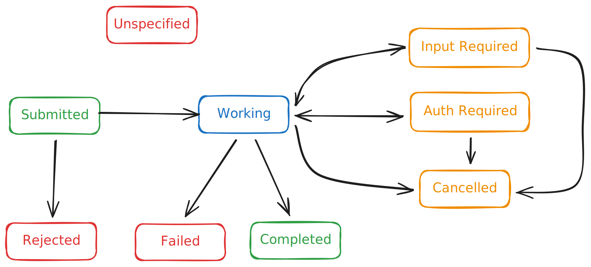

## Why agents need friends?

We've recently seen a boom in AI "agents". AI Agents are usually described as a service that talks to an AI model to perform some kind of goal-based operation using tools and context it assumes.

But most of these agents are still working in an isolated environment. You build an agent into your application and it offers some capabilities, but that's it. You're basically building a monolith with AI in it.

If you prefer a visual explanation, here's a video introduction to A2A:

<div style="text-align: center; margin: 2rem 0;">
  <iframe width="560" height="315" src="https://www.youtube.com/embed/BOpzs5AGU50" title="YouTube video player" allow="accelerometer; autoplay; clipboard-write; encrypted-media; gyroscope; picture-in-picture; web-share" allowfullscreen style="max-width: 100%; border-radius: 0.75rem;"></iframe>
</div>

## The idea behind A2A

The initial concept is really simple, let agents talk to each other. 

If we draw a quick parallel to how we work as humans, if tomorrow I want to build a house I will probably not try to do it by myself. I will call different experts with their own expertise and skills, and they will work together to build the house. Why should your AI Agent rely on a "do-everything" agent then ?

In the real world, collaboration is how things get done. A2A is exactly that. It allows specialized agents to communicate, coordinate and share work.

## What's A2A ?

[A2A](https://a2a-protocol.org/latest/) is a protocol that was initially developed by Google, but that is now part of the Linux Foundation. Several big major tech companies are contributing to the project.

The protocol defines how agents can:
- discover other agents
- exchange messages and tasks (more on that later)
- work securely together
- share results or errors

### Build on familiar web standards

A2A is built using web standards that most developers already know. You can actually use different protocols:
- HTTP/REST
- JSON-RPC
- gRPC

This makes any kind of integration flexible and future-proof. The only issue with supporting different protocols is that all agents supporting A2A might not use the same one, making it a bit more difficult to use.

### Secure by default

We've all heard about the infamous lack of "S" for security in [MCP](https://modelcontextprotocol.io/). A2A is by default secure. It supports enterprise grade authentication and authorization, by being on par with OpenAPI's authentication schemes.

### Discoverability

To be able to communicate with each other, agents need to, first, be able to discover each other. To do so, each agent will provide an Agent card.
This card is really similar to a resume. It will contain the identity of the agent and its capabilities.

The agent card describes the agent's name, version, capabilities (eg: streaming, notifications,...) and it's specific skills. The card is exposed at a well-known URL: `.well-known/agent.json`

### to Task or not to Task?

A2A introduces the concept of task. A task, as the name suggests, is a unit of work. A2A can work with or without tasks but I personally prefer to use them.
A task can be synchronous or asynchronous. You probably don't want to block your agent while it's doing some heavy computation. A task has a state, and we will see a bit further how its state can vary during the execution of the task.

Since A2A supports longing running tasks, it needs a way to communicate with the client agent. You could always go for a polling approach, but that would be really inefficient.
A2A supports SSE (Server Sent Events) and Webhooks allowing agents to communicate with each other in a more efficient way. 
It also supports reconnection if the SSE connection is lost.
SSE is a great solution for real-time communication, but for really long-running tasks, using webhooks is likely the better option.

### Not only text

AI models can handle a lot more than just text. We often talk about multi-modality where models, like Gemini from Google, support a large variety of inputs (text, images, audio, video,...).
As you can imagine A2A supports multimodality out of the box for the inputs and outputs. It allows us to build very rich and capable agents that can interact with each other.

### Extensible

A2A is built to be extended for specific use cases. A2A offers a lot of capabilities, but for certain aspects we might need more specific features.
There are already some existing extensions for A2A, such as [AP2](https://cloud.google.com/blog/products/ai-machine-learning/announcing-agents-to-payments-ap2-protocol), that offer a payment protocol over A2A.

## How does it work?

As discussed earlier, the first step is to discover other agents and get their agent cards. 
Once it's done, your agent will be able to communicate with other agents and create tasks.
Those tasks will need to be managed by the agents and for that there are various states. 
Let's see them in action. In the following step, it will be assumed to have 2 agents. 
The first agent will be used a client and we will call it `Neo`.
The second agent will be used as a server and we will call it `Smith`.

### Happy flow

The first step is to submit a task. In this scenario, `Neo` will send a task to `Smith`. 
Once `Smith` receives the task and accepts it, it will set the state to `SUBMITTED`.

Once `Smith` starts working on the task, he will update the state to `WORKING`.

At some point, `Smith` might realize he needs more information from `Neo` to complete the task. 
In that case, it will update the state to 'INPUT REQUIRED' and send a message to `Neo` asking for more information. 

If `Neo` responds with the required information, `Smith` will update the state back to `WORKING` and continue working on the task.

This interaction is key in the protocol since it shows that the agents are not working just as a client-server solution but can really interact and collaborate with each other.

At some point, we can imagine that `Smith` will have completed his work, update the state to `COMPLETED` and send a message to `Neo` with the result of his work.
This result is what A2A calls an Artifact. An artifact is the result of a task it might contain one or multiple parts with different type of data (text,audio,image,...) giving us multimodal returns.

You can see here a diagram illustrating the happy flow.
{#mermaid}
sequenceDiagram
autonumber
participant Neo
participant Smith

    %% 1. Neo submits the task
    Neo->>Smith: Submit Task
    Note right of Smith: Smith receives the task
    Smith->>Smith: Accept Task<br/>Set state = SUBMITTED

    %% 2. Smith starts working
    Note right of Smith: Smith starts working on the task
    Smith->>Smith: Update state = WORKING

    %% 3. Smith needs more input
    Note over Smith: Needs more information to continue
    Smith->>Smith: Update state = INPUT REQUIRED
    Smith->>Neo: Request additional information

    %% 4. Neo responds, work continues
    Neo-->>Smith: Provide requested information
    Smith->>Smith: Update state = WORKING<br/>Continue task

    Note over Neo,Smith: Agents interact and collaborate<br/>beyond simple client-server

    %% 5. Smith completes the task and returns Artifact
    Smith->>Smith: Complete work<br/>Update state = COMPLETED
    Smith-->>Neo: Send Artifact (task result)
    Note left of Neo: Artifact can include<br/>text, audio, image, ...
{/}

### What could go wrong?

We all know that things don't always go as planned, to handle that A2A has a couple of useful states that we'll go through in the following sections.

Let's imagine that `Smith` is working on a task and for some reason fails at some point. In that case, the task state will be updated to `FAILED`. `Smith` will then send a message to `Neo` explaining what went wrong.
{#mermaid}
sequenceDiagram
autonumber
participant Neo
participant Smith

    %% Smith is already working on a task
    Note right of Smith: Smith is working on the task

    %% Failure occurs
    Smith->>Smith: Error occurs<br/>Update state = FAILED

    %% Notify Neo about the failure
    Smith-->>Neo: Send failure message<br/>Explain what went wrong

    Note over Neo,Smith: Failure is communicated clearly<br/>so Neo can react appropriately
{/}

Another case could be that `Neo` gave a task to `Smith` but after all realizes it doesn't need `Smith` to complete his work. In that case, `Neo` sends a message to `Smith` to cancel the task and `Smith` will update the state to `CANCELED`.

{#mermaid}
sequenceDiagram
autonumber
participant Neo
participant Smith

    %% Smith is working on a task Neo previously submitted
    Note right of Smith: Smith is currently working on Neo's task

    %% Neo decides to cancel
    Neo-->>Smith: Cancel Task Request

    %% Smith processes cancellation
    Smith->>Smith: Update state = CANCELED
{/}

In the following scenario, `Neo` sends a task to `Smith`. But what `Neo` doesn't know is that `Smith` is already very busy and will not be able to work on it. 
In that case, `Smith` will update the state to `REJECTED` and send a message to `Neo` explaining that he will not be able to work on the task.
{#mermaid}
sequenceDiagram
autonumber
participant Neo
participant Smith

    %% Neo sends a new task
    Neo->>Smith: Submit Task

    %% Smith is busy
    Note right of Smith: Smith is already busy<br/>Cannot take this task

    %% Smith rejects the task
    Smith->>Smith: Update state = REJECTED
{/}

Finally let's imagine that `Smith` is working on a task for `Neo` but at some point realizes that `Neo` does not have the necessary privileges for `Smith` to complete the action. It's the classical case of the `sudo` on linux. In order to complete the action, `Smith` will update the state to `AUTH REQUIRED` and send a message to `Neo` asking for authorization. If then `Neo` provides the necessary authentication elements to `Smith`, then `Smith` will continue working on the task.

{#mermaid}
sequenceDiagram
autonumber
participant Neo
participant Smith

    %% Smith is working on Neo's task
    Note right of Smith: Smith is working on the task

    %% Privilege issue discovered
    Smith->>Smith: Detect insufficient privileges<br/>Update state = AUTH REQUIRED

    %% Request authorization
    Smith-->>Neo: Request authorization<br/>(e.g. sudo-like credentials)

    %% Neo provides required authentication
    Neo-->>Smith: Provide authorization elements

    %% Smith resumes work
    Smith->>Smith: Continue working on task<br/>state = WORKING
{/}

### Into the unknown

There's one last state supported by the protocol. This state is `unspecified` (previously called `unknown`). This state is used when the state of the task cannot be determined. For instance this could occur if a task has expired or the ID of the task is invalid.

### Terminal states

Among the states, a few of them are considered terminal. 
They are the ones that indicate that the agent is done with this task. 
This could mean that either the agent a completed the task or that the agent is not able to continue working on it.
The following states are considered terminal:
- COMPLETED
- FAILED
- CANCELED
- REJECTED

You can find more info on the different states in the [specification](https://a2a-protocol.org/latest/specification/#413-taskstate).

### States summary

Here you'll find a summary of the states supported by the protocol and how can transition from one state to another.



## What about MCP?

One of the frequent questions I get is how A2A is different from MCP. 
MCP is an open source standard introduced by Anthropic that allows AI systems to connect with external tools and data.
It's frequently described as the USB for AI, since it allows AI systems to connect to external tools and data using the same protocol.

On the other hand, A2A is a protocol connect agent together. 
If we want to make the same kind of analogy as for MCP, A2A would be the Ethernet of AI, since it allows AI agents to connect.

The two protocols have very different purposes and use cases. An A2A agent could use MCP to connect to some tools. 

## Show me the code!

Of course, a protocol is great but you might wonder how can leverage it in your application. 
A2A has already a few implementations in different languages.
You might guess that Python was the first one, but Java already has its own implementation. 
LangChain4J is already supporting an A2A client as part of the `langchain4j agentic` module.

So in this short demo, we will build a couple of agents that will expose an A2A server and use another agent to communicate with it.
We will build a team of super heroes with a team leader and some team members, their goal is to save the world.

If you want to follow along, all the code is available on [github](https://github.com/LoMagnette/2025-DEVOXX-A2A)

### A2A server aka Team member

So first, we have our team member `IronRam`. We will first define our AI service using LangChain4J and Quarkus.

#### Dependencies

To do so, we will need the following Maven dependencies:
```xml
    <dependency>
        <groupId>io.quarkiverse.langchain4j</groupId>
        <artifactId>quarkus-langchain4j-ollama</artifactId>
    </dependency>
    <dependency>
        <groupId>io.github.a2asdk</groupId>
        <artifactId>a2a-java-sdk-reference-jsonrpc</artifactId>
        <version>$\{io.a2a.sdk.version}</version>
    </dependency>
```

#### AI Service
Then we will create an AiService using quarkus-langchain4j.
```java
import dev.langchain4j.service.SystemMessage;
import dev.langchain4j.service.UserMessage;
import io.quarkiverse.langchain4j.RegisterAiService;
import io.quarkiverse.langchain4j.ToolBox;
import jakarta.enterprise.context.ApplicationScoped;

import java.util.List;

@RegisterAiService
@SystemMessage("""
        You're IronRam, a genius, billionaire, philanthropist. You're a superhero protecting universe 8444.
        You can fly through space using your IronRamArmor navigation capability.
        You can also collect object through the universe.
        """)
@ApplicationScoped
public interface IronRam {


    @UserMessage("""
                You need to collect all objects matching the keywords.
                Follow these steps carefully and use the available tools in the correct order.
               //...
            
                The answer should be a simple json array of string without any special characters
            
               ---
               keywords: \{objectsDescription}
            
            """)
    @ToolBox(\{Baarvis.class, IronRamArmor.class})
    List<String> collect(String objectsDescription);
}
        
```

This AI service can of course use some tools as indicated by the `@ToolBox` annotation. It could also use some MCP tools.

#### Agent card

One key element of the A2A protocol is the agent card. To define the agent, we will create an `AgentCardProducer` class. 

That class will have a method annotated with `@Produces` and `@PublicAgentCard` that will be in charge of creating the agent card and returning it.

To produce the agent card we will use the builder provide by the AgentCard class. 
You can see in the code below that we will be able to describe the agent and its capabilities, but also its skills.
One key element of this card is the examples in the skills section. It will provide some examples of how to use the skill for the calling agent.

```java
import io.a2a.server.PublicAgentCard;
import io.a2a.spec.AgentCapabilities;
import io.a2a.spec.AgentCard;
import io.a2a.spec.AgentSkill;
import jakarta.enterprise.context.ApplicationScoped;
import jakarta.enterprise.inject.Produces;
import jakarta.inject.Inject;
import java.util.Collections;
import java.util.List;
import org.eclipse.microprofile.config.inject.ConfigProperty;

/** Producer for Content Writer Agent Card. */
@ApplicationScoped
public final class IronRamAgentCardProducer {

  /** HTTP port for the agent. */
  @Inject
  @ConfigProperty(name = "quarkus.http.port")
  private int httpPort;

  /**
   * Creates the agent card for the content writer agent.
   *
   * @return the agent card
   */
  @Produces
  @PublicAgentCard
  public AgentCard agentCard() {
    return new AgentCard.Builder()
        .name("IronRam Agent")
        .description("""
                      IronRam, genius, billionaire, philanthropist.
                      He's a super hero to protect universe 8444.
                      He can fly through space using his IronRamArmor navigation capability.
                      He can also collect objects through the universe.
            """)
        .url("http://localhost:" + httpPort)
        .version("1.0.0")
        .documentationUrl("http://example.com/docs")
        .capabilities(
            new AgentCapabilities.Builder()
                .streaming(true)
                .pushNotifications(false)
                .stateTransitionHistory(false)
                .build())
        .defaultInputModes(Collections.singletonList("text"))
        .defaultOutputModes(Collections.singletonList("text"))
        .skills(
            Collections.singletonList(
                new AgentSkill.Builder()
                    .id("ironram")
                    .name("Goes through space and collect objects")
                    .description(
                            """
                            Goes through space using his IronRamArmor and collects objects based on a given description.
                            """)
                    .tags(List.of("collector","super hero"))
                    .examples(
                        List.of(
                            "Go collect all the infinity stones"))
                    .build()))
        .protocolVersion("0.3.0")
        .build();
  }
}
```

#### Agent Executor

Now that we have our AI service and our agent card, we need to handle the incoming tasks and handle it.

To do so, we will create an `AgentExecutorProducer` class or more exactly in our case, an `IronRamAgentExecutorProducer` class. This class will be in charge of creating the agent executor and returning it. To do so we create method annotated with `@Produces` that will create the executor and return it.

In our case, we've defined the Executor class as an internal class of the `IronRamAgentExecutorProducer` class. 
This class is named in this case SuperHeroExecutor and implements the AgentExecutor interface.
This interface requires implementing 2 methods:
- execute: in charge of handling the incoming task and processing it, but also handling all the eventual state changes. In our case, the implementation is relatively straightforward: We get the task text content, provide it to our AI service, and return the result.
- cancel: in charge of handling the cancellation of the task.
```java
import io.a2a.server.agentexecution.AgentExecutor;
import io.a2a.server.agentexecution.RequestContext;
import io.a2a.server.events.EventQueue;
import io.a2a.server.tasks.TaskUpdater;
import io.a2a.spec.JSONRPCError;
import io.a2a.spec.Message;
import io.a2a.spec.Part;
import io.a2a.spec.Task;
import io.a2a.spec.TaskNotCancelableError;
import io.a2a.spec.TaskState;
import io.a2a.spec.TextPart;
import jakarta.enterprise.context.ApplicationScoped;
import jakarta.enterprise.inject.Produces;
import jakarta.inject.Inject;

import java.util.List;


@ApplicationScoped
public final class IronRamAgentExecutorProducer {

    @Inject
    private IronRam ironRam;

    /**
     * Creates the agent executor for the content writer agent.
     *
     * @return the agent executor
     */
    @Produces
    public AgentExecutor agentExecutor() {
        return new SuperHeroExecutor(ironRam);
    }

    /**
     * Agent executor implementation for content writer.
     */
    private static class SuperHeroExecutor implements AgentExecutor {

        private final IronRam agent;

        SuperHeroExecutor(final IronRam ironRam) {
            this.agent = ironRam;
        }

        @Override
        public void execute(final RequestContext context,
                            final EventQueue eventQueue) throws JSONRPCError {
            final TaskUpdater updater = new TaskUpdater(context, eventQueue);

            // mark the task as submitted and start working on it
            if (context.getTask() == null) {
                updater.submit();
            }
            updater.startWork();

            // extract the text from the message
            final String assignment = extractTextFromMessage(context.getMessage());

            // call the content writer agent with the message
            final String response = String.join(", ", agent.collect(assignment));

            // create the response part
            final TextPart responsePart = new TextPart(response, null);
            final List<Part<?>> parts = List.of(responsePart);

            // add the response as an artifact and complete the task
            updater.addArtifact(parts, null, null, null);
            updater.complete();
        }

        private String extractTextFromMessage(final Message message) {
            final StringBuilder textBuilder = new StringBuilder();
            if (message.getParts() != null) {
                for (final Part part : message.getParts()) {
                    if (part instanceof TextPart textPart) {
                        textBuilder.append(textPart.getText());
                    }
                }
            }
            return textBuilder.toString();
        }

        @Override
        public void cancel(final RequestContext context,
                           final EventQueue eventQueue) throws JSONRPCError {
            final Task task = context.getTask();

            if (task.getStatus().state() == TaskState.CANCELED) {
                // task already canceled
                throw new TaskNotCancelableError();
            }

            if (task.getStatus().state() == TaskState.COMPLETED) {
                // task already completed
                throw new TaskNotCancelableError();
            }

            // cancel the task
            final TaskUpdater updater = new TaskUpdater(context, eventQueue);
            updater.cancel();
        }
    }
}

```

#### Testing our A2A server

With all that, you should be able to run your A2A server locally. 
If you want to test it you can use the [A2A inspector](https://github.com/a2aproject/a2a-inspector) and connect it to your A2A server.

The A2A Inspector is a web application that's very easy to run and can be used to inspect any A2A server agent.

We can use the A2A Inspector to validate our A2A server agent by specifying our server agent's URL in the Connect text box.

The A2A Inspector will obtain and show our server agent’s agent card


## A2A client aka Team Leader

To test our A2A server using java you can use the [A2A Java SDK](https://github.com/a2aproject/a2a-java-sdk).
But you can also take advantage of the Langchain4j Agentic module that supports A2A out of the box.
It's really easy to use.

First you need to add the langchain4j-agentic dependency to your project.
```xml
<dependency>
    <groupId>dev.langchain4j</groupId>
    <artifactId>langchain4j-agentic</artifactId>
    <version>1.9.1-beta17</version>
</dependency>
<dependency>
    <groupId>dev.langchain4j</groupId>
    <artifactId>langchain4j-agentic-a2a</artifactId>
    <version>1.9.1-beta17</version>
</dependency>

```

Then to use the new agentic api of langchain4j and use your A2A server as any other agent.
First you can define an interface describing your server:
```java
public interface IronRam {

    @Agent
    String collect(@V("object") String keywords);
}
```

Once it's done you can use `AgenticService` to create your A2A agent:
```java
var ironRam = AgenticServices
                .a2aBuilder("http://localhost:8080", IronRam.class)
                .inputNames("object")
                .outputName("stones")
                .build();
```
You can see that we're using some input and output names. These names will be used to map the input and output of the agent and store in the AgenticScope of langchain4j.
You can read more about it [here](https://docs.langchain4j.dev/tutorials/agents).

And finally you can use in combination with other agents and build your Agentic solution using a remote agent:
```java
var executeMission = AgenticServices.sequenceBuilder()
        .subAgents(nickWooly, ironRam, bruce)
        .outputName("result")
        .build();
Object invoke = executeMission.invoke(Map.of("mission", """
        BaaNos just destroyed half the universe using the infinity stones.
        The only way to reverse it is to quickly collect the infinity stones and snap it.
        """));
println("-------- Mission results ---------");
println(invoke);
```

If you want to see the full code of this demo, you can clone it from [here](https://github.com/LoMagnette/2025-DEVOXX-A2A).

## Wrap up

In this article, we've seen that A2A enables Agent to Agent collaboration. 
It breaks the silos of the traditional AI solution. To do so it use standard web protocols and enterprise grade technologies.

A2A is not a competitor of MCP, but it's a complementary solution. Agent using A2A can leverage the power of MCP tools.

Finally, A2A is a very young technology and it's still in its early stages. We'll probably see a lot of evolutions in coming month and years.

## References
- [Quarkus](https://quarkus.io)
- [LangChain4J](https://docs.langchain4j.dev/)
- [A2A](https://a2a-protocol.org/latest/)
- [A2A Inspector](https://github.com/a2aproject/a2a-inspector)
- [MCP](https://modelcontextprotocol.io/)
- [AP2](https://cloud.google.com/blog/products/ai-machine-learning/announcing-agents-to-payments-ap2-protocol)
- [Quarkus A2A](https://quarkus.io/blog/quarkus-and-a2a-java-sdk/)


